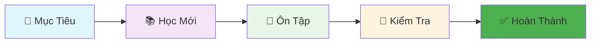

<!-- HEADER ĐẸP VỚI ẢNH BANNER -->

# 🧚‍♀️ KHO TỪ VỰNG TIẾNG TRUNG
## 🎯 HỆ THỐNG HỌC THÔNG MINH - 30 NĂM KINH NGHIỆM

## 📚 MỤC LỤC THƯ VIỆN

| 🗂️ Chủ Đề | 📖 Số Từ | 🎯 Trạng Thái | ⏳ Thời Gian |
|-----------|----------|---------------|-------------|
| [🍜 Ẩm Thực](chapters/food/README.md) | 50 từ | ✅ Hoàn thành | 1 tuần |
| [👨‍👩‍👧‍👦 Gia Đình](chapters/family/README.md) | 30 từ | 🔄 Đang học | 4 ngày |
| [🏠 Nhà Cửa](chapters/house/README.md) | 40 từ | ⏳ Chưa học | - |
| [🚗 Giao Thông](chapters/transport/README.md) | 30 từ | ⏳ Chưa học | - |

## 🎨 THIẾT KÊ BẢNG TỪ VỰNG MẪU

### 🍎 Nhóm 1: Trái Cây
| STT | Chữ Hán | Pinyin | Âm HV | Nghĩa | Ví Dụ | Hình Ảnh |
|-----|----------|---------|--------|--------|---------|----------|
| 1 | 苹果 | píngguǒ | Bình quả | Táo | 我喜欢吃苹果。 | 🍎 |
| 2 | 香蕉 | xiāngjiāo | Hương tiêu | Chuối | 香蕉很甜。 | 🍌 |
| 3 | 橙子 | chéngzi | Trành tử | Cam | 橙子很甜。 | 🍊 |

### 🥬 Nhóm 2: Rau Củ
| 4 | 白菜 | báicài | Bạch thái | Bắp cải | 白菜很好吃。 | 🥬 |
| 5 | 胡萝卜 | húluóbo | Hồ la bặc | Cà rốt | 胡萝卜有营养。 | 🥕 |

## 📊 TIẾN ĐỘ HỌC TẬP

## 🚀 BẮT ĐẦU HỌC

1. **Chọn chủ đề** phù hợp từ mục lục
2. **Học 5-10 từ/ngày** theo lộ trình
3. **Ôn tập định kỳ** theo hệ thống spaced repetition
4. **Thực hành** đặt câu hàng ngày

## 💡 LỜI KHUYÊN TỪ CHUYÊN GIA

> "Học ít mà đều đặn mỗi ngày, tốt hơn học nhiều trong một ngày rồi bỏ." - GS. TS. 30 năm kinh nghiệm

---

**✨ Bắt đầu hành trình chinh phục tiếng Trung ngay hôm nay! ✨**

