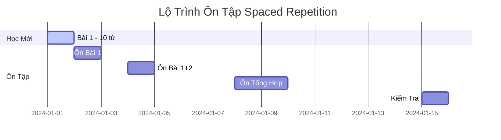
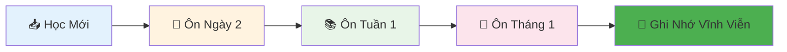

<div align="center">

# 🔁 HỆ THỐNG ÔN TẬP SPACED REPETITION
## 🧠 Kỹ Thuật Ghi Nhớ 30 Năm Kinh Nghiệm


</div>

## 📅 LỊCH TRÌNH ÔN TẬP THÔNG MINH



## 🎯 BẢNG KẾ HOẠCH ÔN TẬP CHI TIẾT

| Ngày | Bài Ôn | Số Từ | Phương Pháp | Thời Gian |
|------|---------|--------|-------------|-----------|
| **+1 ngày** | Bài mới học | 100% từ | Active recall | 15 phút |
| **+3 ngày** | Bài cũ | 70% từ khó | Flashcards | 20 phút |
| **+1 tuần** | Tổng ôn | 50% từ | Viết lại | 25 phút |
| **+2 tuần** | Ôn sâu | 30% từ quan trọng | Đặt câu | 15 phút |
| **+1 tháng** | Ôn tổng thể | 20% từ | Thực hành | 30 phút |

## 🃏 HỆ THỐNG FLASHCARDS THÔNG MINH

### 🎴 Flashcard Mẫu - Thiết Kế Đẹp

<div class="flashcard-container">

**Mặt Trước:**
```markdown
🍎 [Hình ảnh quả táo]

**Chữ Hán:** ???
**Nghĩa:** ???
```

**Mặt Sau:**
```markdown
🍎 [Hình ảnh quả táo]

**Chữ Hán:** <span class="chinese-char">苹果</span>
**Pinyin:** `píngguǒ`
**Nghĩa:** Táo
**Âm Hán Việt:** Bình quả
**Ví dụ:** 我喜欢吃**苹果**。
```

</div>

## 📊 THEO DÕI HIỆU QUẢ ÔN TẬP

### Biểu Đồ Tiến Độ


## 🎨 CÔNG CỤ ÔN TẬP TRỰC QUAN

### 1. Bảng Ôn Tập Hàng Ngày
| Thời Gian | Nội Dung Ôn | Trạng Thái | Điểm Số |
|-----------|-------------|------------|---------|
| 07:00 AM | 10 từ mới | ✅ Hoàn thành | 85% |
| 08:00 PM | 15 từ cũ | 🔄 Đang ôn | 92% |

### 2. Hệ Thống Đánh Giá
```markdown
🎯 THANG ĐÁNH GIÁ:
⭐️⭐️⭐️⭐️⭐️ (95-100%): Xuất sắc
⭐️⭐️⭐️⭐️☆ (85-94%): Tốt  
⭐️⭐️⭐️☆☆ (75-84%): Khá
⭐️⭐️☆☆☆ (65-74%): Trung bình
⭐️☆☆☆☆ (0-64%): Cần cố gắng
```

## 💡 MẸO ÔN TẬP HIỆU QUẢ

### 🧠 Kỹ Thuật Active Recall
> "Tự kiểm tra thay vì đọc lại - Đây là bí quyết thành công!"

**Ví dụ thực tế:**
- ❌ Sai: Đọc đi đọc lại "苹果 - táo"
- ✅ Đúng: Tự hỏi "Táo tiếng Trung là gì?" → Cố nhớ → Kiểm tra

### 🎵 Phương Pháp Đa Giác Quan
```markdown
1. 👀 Nhìn chữ Hán
2. 👂 Nghe phát âm  
3. 👄 Nói to từ đó
4. ✍️ Viết lại từ
5. 🧠 Liên tưởng hình ảnh
```

## 📱 LỊCH ÔN TẬP MẪU CHO NGƯỜI MỚI

### Tuần Đầu Tiên:
- **Thứ 2:** Học 10 từ mới + Ôn 0 từ cũ
- **Thứ 3:** Học 10 từ mới + Ôn 10 từ (ngày 1)
- **Thứ 4:** Học 10 từ mới + Ôn 20 từ (ngày 1+2)
- **Thứ 5:** Học 10 từ mới + Ôn 30 từ
- **Thứ 6:** Ôn tổng hợp 40 từ
- **Thứ 7:** Kiểm tra tuần
- **Chủ nhật:** Nghỉ ngơi

---
<div align="center">

**✨ Bắt đầu ôn tập ngay hôm nay để đạt hiệu quả tốt nhất! ✨**

[⬆️ Quay lại trang chủ](../README.md)

</div>
